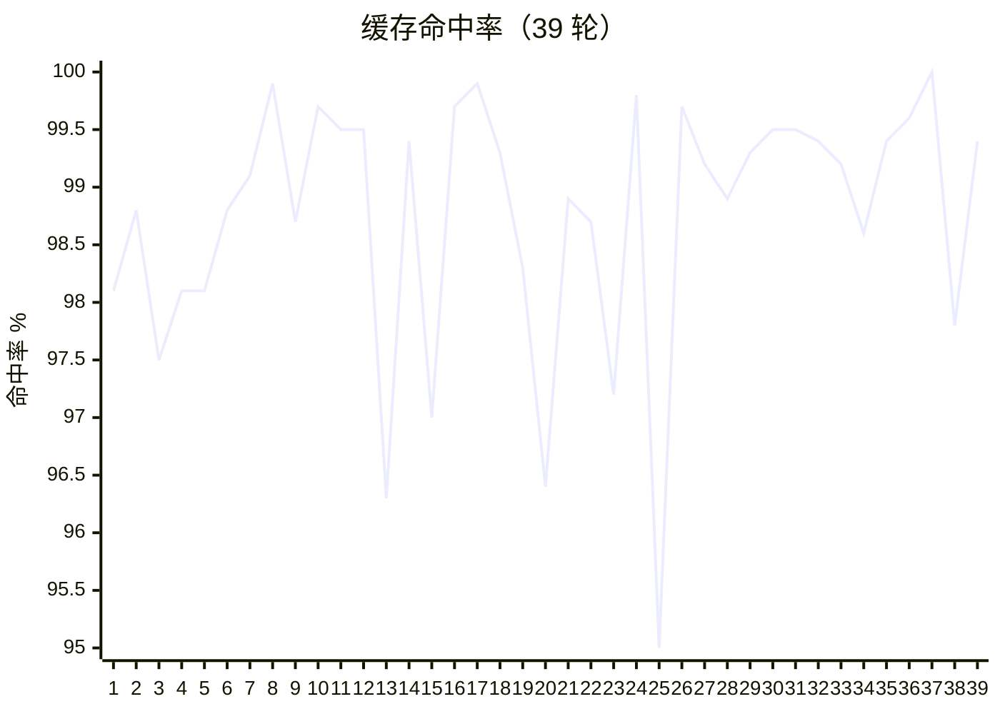

**[English](README.md) | [中文](README.zh-CN.md)**

<p align="center">
  
</p>

一个用 Go 编写的最小化终端编码代理框架（harness）——Pi 的姊妹项目。
刻意保持清亮：一个模型循环、一组工具、一个可读的 TUI——不是塞满功能的终端 IDE。——Pi 的姊妹项目。
刻意保持清亮：一个模型循环、一组工具、一个可读的 TUI——不是塞满功能的终端 IDE。

- **子代理（Sub-agents）** — 拉起隔离任务，在 TUI / job 日志里完整看到执行过程，而不是把每一步都塞进父会话上下文
- **Hashline 编辑** — 用整文件 `@file path#TAG` 加上行级 `LINE#HASH` 锚点改文件（思路对齐 [oh-my-pi](https://github.com/can1357/oh-my-pi)）：模型瞄锚点改，而不是整文件重写；TAG/哈希对不上就拒绝，避免过度编辑和静默写坏
- **权限门控** — 危险工具先过 Gate / Ask；代理能碰你的代码树时，安全不是可选项
- **MCP 不炸上下文** — 随便配多少 MCP 服务器，工具 schema **绝不**进模型 prompt。系统提示只列 **server 名**（像 Skills 目录）；Agent 用三个元工具（`mcp_list` / `mcp_inspect` / `mcp_call`）按需发现再调用；权限仍走 Gate / Ask / Hooks。详见 [MCP](#mcp)
- **任意模型** — OpenAI 兼容或 Anthropic，无厂商锁定

<p align="center">
  <a href="https://github.com/pulseaiclub/phi/blob/main/LICENSE"></a>
  <a href="https://github.com/pulseaiclub/phi/actions"></a>
  <a href="https://go.dev"></a>
  <a href="https://github.com/pulseaiclub/phi/releases"></a>
</p>


你可以通过 [Skills（技能）](#skills技能)、[Hooks（钩子）](#hooks钩子)
和 [MCP](#mcp) 扩展它——不必做成插件框架。

- [快速开始](#快速开始)
- [资源占用](#资源占用)
- [配置](#配置)
- [交互模式](#交互模式)
- [命令](#命令)
- [会话](#会话)
- [无头模式](#无头模式)
- [Skills（技能）](#skills技能)
- [权限](#权限)
- [Hooks（钩子）](#hooks钩子)
- [MCP](#mcp)
- [子代理](#子代理)
- [工具](#工具)
- [项目结构](doc/project-layout.md)

## 快速开始

安装最新发布版本（macOS / Linux）：

```sh
curl -fsSL https://raw.githubusercontent.com/pulseaiclub/phi/main/scripts/install.sh | bash
```

Windows（PowerShell 5.1+）：

```powershell
irm https://raw.githubusercontent.com/pulseaiclub/phi/main/scripts/install.ps1 | iex
```

首次启动需要配置模型。使用下面这个命令打开配置编辑器（会创建 `~/.phi` 目录结构并写入 `~/.phi/config.yaml`）：

```sh
phi config
```

也可以设置环境变量做一次性运行：

```sh
export PHI_MODEL=gpt-4o
export PHI_API_KEY=sk-...
```

然后启动 TUI：

```sh
phi
```

或者从源码构建（Go 1.26.3+，见 `go.mod`）：

```sh
make build          # 生成 ./phi
make install        # 构建并安装到 $GOBIN
```

首次启动时，phi 会自动创建 `~/.phi/{bin,skills,hooks,session}`。搜索工具
（`fd`、`rg`）缺失时会在后台下载到 `~/.phi/bin`。

TUI 给模型提供四个核心工具——`read`、`write`、`edit` 和 `bash`——外加 `grep`、`find`、`ls`。模型用这些工具来完成你的请求。外部 HTTP 抓取在配置 MCP 后可用。

## 资源占用

phi 的目标是运行便宜、也便于动手改造。以下数据来自剥离的发布构建
（`CGO_ENABLED=0`，`-ldflags="-s -w"`），除注明外均在 macOS arm64 上测得。

| 指标 | phi |
| --- | ---: |
| 发布二进制 | **约 12 MB** |
| 空闲 RSS（1 个会话） | **约 21 MB** |
| 10 个空闲会话（RSS 总量） | **约 196 MB**（每个约 20 MB） |
| 首帧时间 | **约 40 ms**（27–65 ms） |
| 冷 `go build`（空 `GOCACHE`） | **约 5.5 s** |
| 热重建 | **约 0.7 s** |
| Go 源码（不含测试） | **约 22k 行** / 107 个文件 |
| Go 包数量 | **32** |
| 直接模块依赖 | **6**（共 15 个模块） |
| 链接运行时 | 仅系统库（无 Node / Electron / Python） |

## 配置

phi 读取 `~/.phi/config.yaml`（标准 YAML）。环境变量可覆盖配置，用于一次性运行。
`phi config` 会在浏览器中打开一个 HTML 编辑器来编辑同一个文件。


```yaml
# ~/.phi/config.yaml
models:
  - name: gpt-4o            # 模型名；"claude-*" 走 Anthropic API
    api_key: sk-...         # 或设置 PHI_API_KEY
    base_url: https://api.openai.com/v1   # 默认；PHI_BASE_URL 可覆盖
    context_window: 128000  # 可选
    default: true           # 启动时使用的模型；缺省时第一项生效
  - name: claude-sonnet-4-20250514   # 额外模型；运行时可切换
    api_key: sk-ant-...
    base_url: https://api.anthropic.com
    context_window: 200000

skill_path: ~/.phi/skills # SKILL.md 文件的加载目录

agents:
  enabled: true           # 默认；设为 false 可禁用 agent_* 子代理工具

permissions:
  mode: interactive       # interactive | readonly | autopilot | headless-strict
  bash:
    default: ask          # ask | allow | deny
    allow:
      - "go test ./..."
    deny:
      - "rm -rf *"
```

### 推荐模型：DeepSeek Flash

**DeepSeek V4 Flash**（`api.deepseek.com` 上的 `deepseek-chat`）——快、便宜，agent 场景下 prefix cache 真能打。

```yaml
  - name: deepseek-chat
    api_key: sk-...
    base_url: https://api.deepseek.com/v1
    default: true
```

phi + DeepSeek Flash 是最佳搭档：少幻觉，缓存命中率极高。

以下为实测数据：

同一 session **39 轮** LLM 调用 —— prompt **16k→40k**，命中率 **95–100%**（平均 **98.7%**）。

| 轮次 | Prompt tokens | Cached tokens | 命中率 |
| ---: | ---: | ---: | ---: |
| 1 | 16,176 | 15,872 | **98.1%** |
| 10 | 20,163 | 20,096 | **99.7%** |
| 20 | 27,604 | 26,624 | **96.4%** |
| 30 | 35,245 | 35,072 | **99.5%** |
| 39 | 39,794 | 39,552 | **99.4%** |



环境变量覆盖：

| 变量 | 覆盖项 |
| ---------------- | ------------------ |
| `PHI_API_KEY` | `models[].api_key`（默认模型） |
| `PHI_MODEL` | `models[].name`（默认模型） |
| `PHI_BASE_URL` | `models[].base_url`（默认模型） |
| `PHI_SKILL_PATH` | `skill_path` |

提供商路由：base URL 包含 `anthropic` 或模型名以 `claude` 开头时使用
Anthropic Messages API；其余走 OpenAI 兼容的 `/chat/completions` 路径。

### 工作区布局

```
~/.phi/
├── config.yaml   # 全局配置
├── bin/          # 下载的搜索工具（fd、ripgrep）
├── skills/       # SKILL.md 技能目录
├── hooks/        # plugin.json + hook 脚本
├── jobs/         # 子代理任务产物（meta、logs、result.md）
└── session/      # 持久化会话，每个工作目录一个目录
    └── <encoded-cwd>/
```

## 交互模式

`phi`（或 `phi tui`）启动 TUI：上方是对话记录，底部是编辑器，底部状态栏显示
当前活动。有新版发布时，状态栏会提示类似 `0.2.0 available · phi update`。

助手输出按 Markdown（CommonMark/GFM）渲染：标题、强调、删除线、链接、引用、
列表、任务复选框和表格都会按当前主题着色；围栏代码块上方有淡色语言标注，并按语言高亮。
结构标记（`#`、`` ` ``、`*`）会被去除。

编辑器支持：

- `@` —— 模糊文件选择器（输入 `@` 后开始输入路径）
- `/` —— 斜杠命令选择器（`/sessions`、`/resume`、`/clear`）
- `!command` —— 在本地运行 shell 命令，并把输出流式写入对话记录
  （见 [命令](#命令)）
- `Ctrl+K` —— 命令面板：设置 → 模型 / 主题 / 权限 / 代理、技能、hooks

### 键盘快捷键

| 按键 | 作用 |
| -------------- | ------------------------------- |
| `Ctrl+C` | 退出 phi |
| `Esc` | 取消正在运行的代理 / 关闭选择器 |
| `Ctrl+K` | 开关命令面板 |
| `Ctrl+Shift+C` | 复制选中的对话文本 |

主题：`Dark`、`Darcula`、`Pink` 和 `Terminal`（默认），可在面板的
设置 → 主题中切换。

## 命令

| 命令 | 说明 |
| ------------------ | --------------------------------------------- |
| `phi` / `phi tui` | 启动交互式 TUI |
| `phi run -p "…"` | 以无头模式运行一个代理循环（见下文） |
| `phi update` | 下载并安装最新的 GitHub 发布版本 |
| `phi update --check` | 只查询最新版本，不安装 |
| `phi sessions list` | 列出当前目录的持久化会话 |
| `/sessions` | 列出当前目录的会话（TUI 内） |
| `/resume` | 恢复本目录最近一次会话；`/resume <id>` 指定 id 或唯一前缀 |
| `/clear` | 开启一个全新的空会话（TUI 内） |
| `!command` | 在本地运行 shell 命令，把输出流式写入对话记录；`Esc` 取消 |

在 TUI 中，`!command` 通过 `bash -c` 在本地运行——在代理循环之外。它不计入
代理忙碌状态，运行中的命令可以用 `Esc` 取消，且不影响正在进行的代理回合。

## 会话

会话会按工作目录自动持久化到 `~/.phi/session/<encoded-cwd>/`，以 JSONL 轨迹
记录。

- `phi sessions list` —— 列出当前目录的会话 id、修改时间和预览
- TUI 内 `/sessions` —— 同上，在应用内查看
- `/resume` —— 继续本目录最近一次会话（`/resume <id>` 指定 id 或唯一前缀）
- `/clear` —— 开启全新会话（新 id、空对话记录）
- `phi run --session <id>` / `phi run --continue-last` —— 无头模式恢复会话

## 无头模式

```sh
phi run -p "fix the failing test in internal/tools"
```

不启动 TUI，运行一个代理循环。人类可读的日志输出到 stderr；加上 `--jsonl` 后，机器可读事件输出到 stdout，每行一个 JSON 对象。

参数：

| 参数 | 说明 |
| -------------------- | ---------------------------------------------- |
| `-p, --prompt STRING` | 要运行的提示词（必填） |
| `--jsonl` | 向 stdout 输出 JSONL 事件 |
| `--yolo` | 本次运行跳过所有权限检查（仅用于 benchmark / CI） |
| `--max-rounds N` | 限制工具轮数（默认 64） |
| `--timeout DURATION` | 限制 Agent 运行总时长（例如 `10m`，默认不限制） |
| `--session ID` | 按 id 或唯一前缀恢复已持久化的会话 |
| `--continue-last` | 恢复当前目录最新的持久化会话 |
| `--session-dir DIR` | 覆盖会话存储目录 |

退出码：`0` 成功 · `1` 运行时/LLM 错误 · `2` 达到最大轮数 ·
`3` 配置/用法错误。

交互式 TUI 在工具轮数耗尽时会询问 Continue / Stop。
无头 `phi run` 没有确认界面，因此直接以退出码 2 结束。

无头模式下，权限 `ask` 的决策会被拒绝（没有审批界面），因此无需额外参数
即可获得 `readonly` 级别的安全性。跑 benchmark 需要任意 shell（`pytest`、
`npm test` 等）时，对该次运行加 `--yolo` 即可跳过权限门控。

## Skills（技能）

技能是包含 `SKILL.md` 文件的目录，文件带 YAML frontmatter 和 Markdown 正文。
它们从 `~/.phi/skills/`（或 `skill_path` / `PHI_SKILL_PATH`）加载，注入到代理
上下文中，让你能给模型提供可复用的流程：

```markdown
---
name: My Skill
 description: What this skill does
license: MIT
compatibility: claude, openai
---
Instructions the agent should follow when this skill is relevant.
```

在 TUI 中，可以从面板添加技能（技能 → 列表），然后在勾选所需技能后发送
消息。

## 权限

工具执行受权限策略门控，因此代理默认只读，遇到破坏性操作会先询问。在
`~/.phi/config.yaml` 的 `permissions:` 下配置。

模式：

| 模式 | 行为 |
| ------------------ | --------------------------------------------------- |
| `interactive` | 默认。`ask` 决策在 TUI 中弹出询问。 |
| `readonly` | 拒绝写入 / bash；只读工具仍可用。 |
| `autopilot` | 把 `ask` 折叠为 allow，无人值守运行。 |
| `headless-strict` | 把 `ask` 折叠为 deny（`phi run` 使用）。 |

按工具的规则：`bash.default` / `bash.allow` / `bash.deny`（精确命令前缀匹配）。
全局键：`workspace_only_writes`
（默认 true）、`ask_timeout_sec` 和 `dangerously_allow_all`（默认 false）。

在 TUI 中，审批对话框会替换编辑器，提供批准、带反馈地拒绝、或对本次会话 /
所有会话全部允许等选项。面板的 设置 → 权限 条目可切换会话级绕过。

## Hooks（钩子）

Hooks 在每个工具调用周围运行自定义逻辑——权限门控之前、执行之后。用于组织
策略、审计或改写工具输入，无需改动 phi 二进制或 `config.yaml`。

每个插件是 `hooks/` 下的一个目录，`plugin.json` 和可执行文件放在一起：

```json
{
  "hooks": [
    {
      "name": "guard-bash",
      "event": "pre_tool",
      "match": "bash",
      "run": "./run.sh",
      "fail_closed": true
    },
    {
      "name": "review",
      "event": "command",
      "run": "./review.sh"
    }
  ]
}
```

Hooks 从 `~/.phi/hooks/` 和 `<cwd>/.phi/hooks/` 加载；同名项目 hook 会覆盖
用户 hook。`event: "command"` 会注册 TUI 斜杠命令（`/name` 跑对应脚本）。在 TUI 中可用 `Ctrl+K` → hooks 列出或重新加载。`readonly` 权限
模式下只运行 `fail_closed` 的 hook，慢速审计 hook 不会拖慢探索。完整指南见
[doc/hooks.md](doc/hooks.md)。

## MCP

**配 100 个 MCP 服务器，开场 schema 仍接近 0 token。**

多数 MCP Host 会在你提问前把全部 `tools/list` schema 塞进上下文——光浏览器类
工具就能烧掉 5 万+ token。phi 不这么干。

Agent 只拿到三个元工具；系统提示里会列出已配置的 **server 名**（不含 schema）：

| 工具 | 作用 |
| --- | --- |
| `mcp_list` | 列某个 server 上的工具**名**（紧凑文本） |
| `mcp_inspect` | 按需拉单个工具的精简参数说明 |
| `mcp_call` | 执行 `server` + `tool` + `args` |

流程：从提示词里的 server 名出发 → `mcp_list(server=…)` → `mcp_inspect` → `mcp_call`。子进程**懒启动**。调用仍走 PreHooks → Gate / Ask → Run → PostHooks。

```sh
phi mcp add browsermcp -- npx @browsermcp/mcp@latest
phi mcp doctor
# 在 TUI 里直接让模型用已配置的 server（不必先猜有没有 MCP）
```

配置：`~/.phi/mcp.json`（项目 `<cwd>/.phi/mcp.json` 可覆盖同名）。
`PHI_MCP=off` 关闭。首版支持 stdio 与 HTTP。

完整文档：[doc/mcp.md](doc/mcp.md)。

## 子代理

子代理工具（`agent_spawn`、`agent_wait` 等）**默认开启**。如果想保持工具精简，可在 `~/.phi/config.yaml` 中禁用：

```yaml
agents:
  enabled: false
```

也可以在当前会话中通过面板切换：设置 → 代理。禁用后这些工具不会注册，模型无法派发任务给子代理。

子代理本身使用一种 **role**（`explore` 默认 | `review` | `worker`）：

| Role | 工具 | 用途 |
|------|--------|---------|
| `explore` | 只读（+ 白名单 bash） | 搜索 / 梳理结构 |
| `review` | 只读（+ 白名单 bash） | 差异 / 检查；不编辑 |
| `worker` | 除嵌套外全部工具 | 已规划的独立编辑 |

默认保持 explore（只读）。只有在父代理已有具体计划时，才优先使用 worker。

## 工具

模型可调用的内置工具（见 `internal/tools/`）：

| 工具 | 用途 |
| -------------- | -------------------------------------------- |
| `bash` | 在工作目录运行 shell 命令 |
| `read` | 读取文件 |
| `write` | 写入文件（受权限门控） |
| `edit` | 精准编辑文件的某一段 |
| `grep` | 跨文件正则搜索 |
| `find` | 文件模式匹配（fd） |
| `ls` | 目录列表 |
| `agent_spawn` | 启动一个隔离的子代理任务（异步） |
| `agent_wait` | 等待任务；只返回简短总结 |
| `agent_list` | 列出任务 |
| `agent_cancel` | 取消运行中的任务 |

子代理的完整记录存放在 `~/.phi/jobs/<id>/`，子代理的上下文**不会**注入父代理上下文——只有 wait/task 的总结会注入。

快速搜索工具（`fd`、`ripgrep`）在首次启动缺失时，会下载到 `~/.phi/bin`。

源码结构图见 [项目结构](doc/project-layout.md)。

开发环境搭建、代码风格与提交规范见 [CONTRIBUTING.md](CONTRIBUTING.md)。
